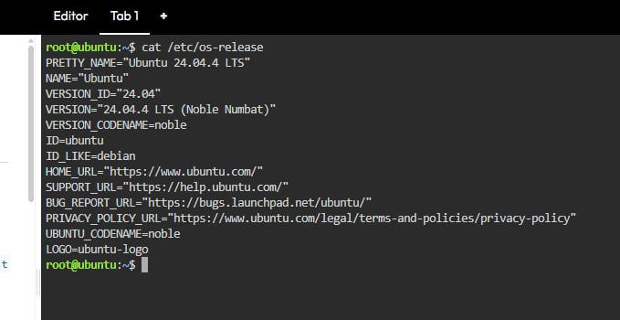
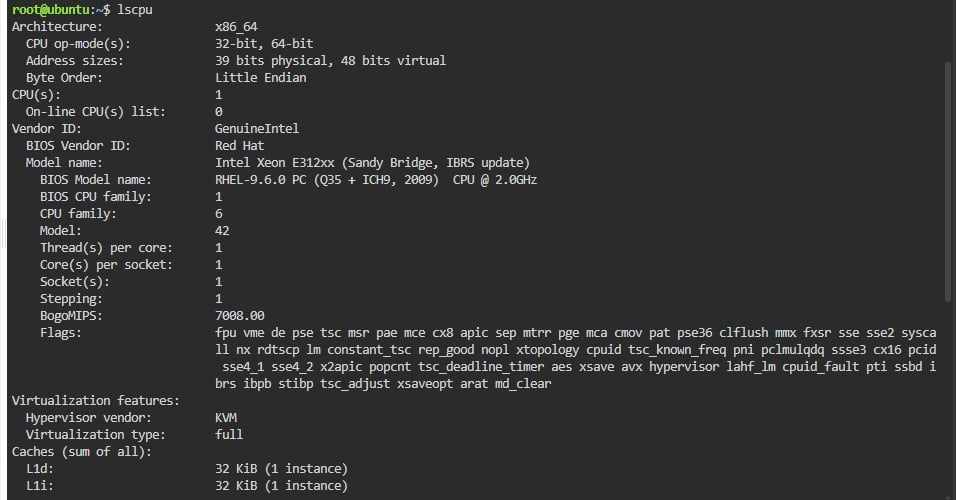
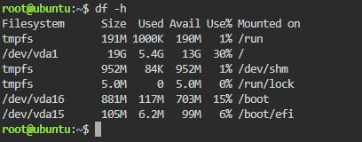

# Laboratory 3 - Multi-Cloud Explorer

## Checkpoint 7 – Linux Investigation

### Linux Server Information
The Linux server was investigated using the KillerCoda Playground:

**Operating System:** Ubuntu 24.04.4 LTS

**CPU Information:** 1

**Memory:** 1.9GB RAM

**Disk Space:** 19GB

### Cloud Migration
If this Linux server were migrated to the cloud:

| Cloud Provider | Service | Purpose |
|---|---|---|
| AWS | Amazon EC2 | Runs Linux virtual machines in the cloud. |
| Microsoft Azure | Azure Virtual Machines | Runs Linux virtual machines on Azure. |
| Google Cloud | Compute Engine | Provides virtual machines for running Linux workloads. |

### After collecting the information, answer:
If this Linux server were migrated to the cloud, which AWS, Azure, and GCP services could host it?
-If this Linux server were migrated to the cloud, it could be hosted using virtual machine services from AWS, Microsoft Azure, and Google Cloud. AWS provides Amazon EC2, Azure provides Azure Virtual Machines, and Google Cloud provides Compute Engine. These services allow organizations to run and manage Linux-based workloads in the cloud.

### Terminal Evidence

