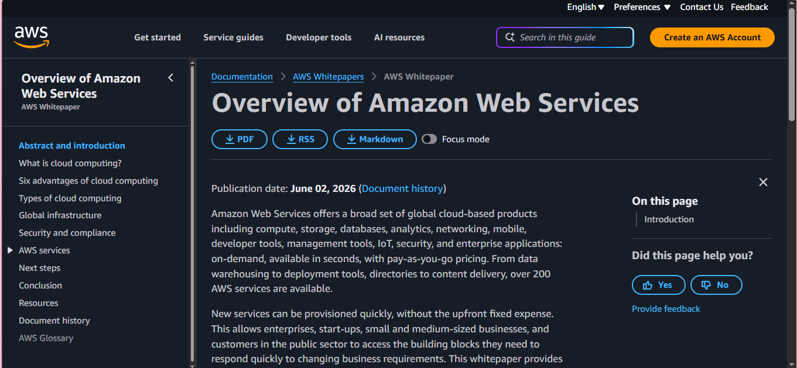
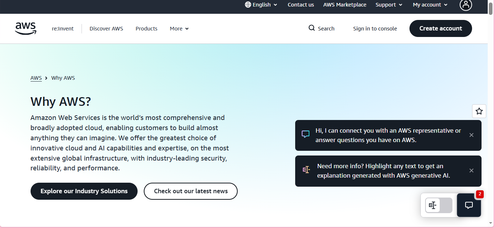

Brief Overview:
Amazon Web Services(AWS) is a leading cloud platform that offers 200+ fully managed services. It also offers a broad set of global cloud-based products including, compute, storage, database, analytics, networking, mobile, developer tools, management tools, security and many more.

Global Infrastructure:
Based on my research the Amazon Web seervices(AWS) Cloud infrastructure is built around AWS Regions and Availability Zones. An AWS Region is a physical location in the world where they have multiple Availability Zones. Availability Zones that consist of one or more discrete data centers, each with redundant power, networking, and connectivity, housed in separate facilities.

Cloud Management Console:
Based on AWS Documentations, The AWS management console is a web-based application that contains and provides centralized access to all individual AWS service consoles. It can use Unified Navigation in the AWS Management Console to search for services, view notifications, access AWS CloudShell, access account and billing information, and customize the general console settings. 

Four Core Services:
-Amazon EC2
-Amazon RDS
-Amazon S3
-AWS IAM

Three Advantages:
The three advantages that based on their own page is;
Security is their highest priority. They've architected infrastructure and services to provide the most secure cloud computing environment.
Cost-Efficiency, they provide pay-as-you-go pricing model where you only pay on many resources you use.
Breaking Through Innovations, AWS is continuously innovating to stay competitive to other businesses.

Typical Enterprise Use Cases
-Data Engineering
-Healthcare
-AI and Machine Learning
-Environmental Sustainability
-Data Driven Innovation

Screenshot
Screenshot of the official AWS website or AWS Management Console:

Sources: https://docs.aws.amazon.com/whitepapers/latest/aws-overview/introduction.html
