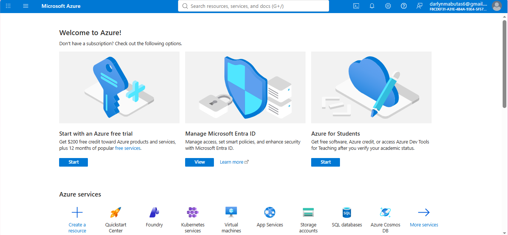

Brief Overview:
Azure is the trusted platform for enterprise intelligence, bringing infrastructure, data, models, and AI apps and agents together as one unified system at global scale.

Global Infrastructure:
Azure's global infrastructure is designed to provide a trusted, sustainable, and advanced cloud and AI infrastructure. It offers a comprehensive cloud and networking footprint to meet data residency and low latency requirements.

Cloud Management Console:
So, based on Microsoft Azure website their management console is called the Microsoft Azure Portal where we can Build, deploy, and optimize resources centrally through Azure account from cloud to edge with an intelligent and intuitive portal.

Four Core Services:
-Azure Virtual Machines
-Azure Cloud Services
-Azure Networking Services
-Azure Blob Storage

Three Advantages:
The three advantages that based on https://www.speakingofclouds.com/microsoft-azure-pros-and-cons/;
High Availability- Microsoft Azure has more than 200 data centers on a global scale, meaning the platform’s vast network of data centers enables it to be highly available and offer low-latency services compared to other cloud systems.  
Security-It offers multi-layered, built-in security controls across physical data centers, operations, and infrastructure to help protect hybrid cloud and multi-cloud systems. 
Disaster Recovery and Back Up-Azure cloud platform comes with end-to-end backup and disaster recovery services to ensure no business-critical data is lost in case a disaster or system crash/failure occurs. 

Typical Enterprise Use Cases:
Based on https://www.velosio.com/blog/top-10-microsoft-azure-use-cases-and-features/
-Azure VMware Solution (AVS)
-Azure Backup and Disaster Recovery (BDR)
-Azure Virtual Servers
-Test Environments with Azure DevTest Labs
-Azure DevOps
-Azure AI

Screenshot
Screenshot of the official AWS website or AWS Management Console:

Sources: https://portal.azure.com/#home
