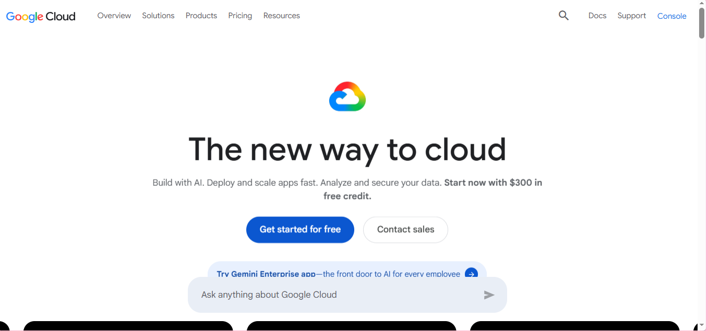

### Brief Overview:
Google Cloud Platform (GCP) is Google’s suite of public cloud computing services that enables businesses, developers, and enterprises to host applications, store data, and manage workloads on a secure, scalable, and high-performance infrastructure.

### Global Infrastructure:
GCP's infrastructure spans multiple regions and availability zones, providing a global presence that ensures low latency and high availability for users. It is available in locations across North America, South America, Europe, Asia, the Middle East, and Australia. These locations are divided into regions and zones. based on their page:(https://docs.cloud.google.com/docs/geography-and-regions)

### Cloud Management Console:
The google cloud management interface is called the google cloud console. It's a browser based graphical interface use to create, configure, monitor and manage google cloud resources.

### Four Core Services:
-Google Kubernetes Engine (GKE)
-Google Cloud Storage
-Virtual Private Cloud (VPC)
-Cloud IAM
 
### Three Advantages:
Global Infrastructure & Performance: GCP operates on Google’s global network of regions and zones, connected via high-speed undersea cables.
Cost Efficiency: GCP’s pay-as-you-go model and per-second billing help reduce costs.
Advanced Security: Security is built-in with encryption at rest and in transit, Identity and Access Management (IAM), and proactive threat detection.

### Typical Enterprise Use Cases
### These are based on the (https://www.databricks.com/blog/google-cloud-use-cases);
Data Engineering Use Cases on Google Cloud;
-Building ETL Pipelines with Delta Lake on Google Cloud Storage
-Real-Time Data Processing with Pub/Sub and Streaming Architectures
Generative AI Use Cases on Google Cloud Platform
-Vertex AI: Google Cloud's Enterprise Generative AI Platform
-AI Agent Development and Deployment at Scale
Machine Learning Use Cases Powered by Google Cloud AI
-Predictive Modeling with Managed MLflow
-Feature Engineering and Google Kubernetes Engine for Scalable ML
And many more enterprise use cases...

### Screenshot:

Sources: https://cloud.google.com/?hl=en
